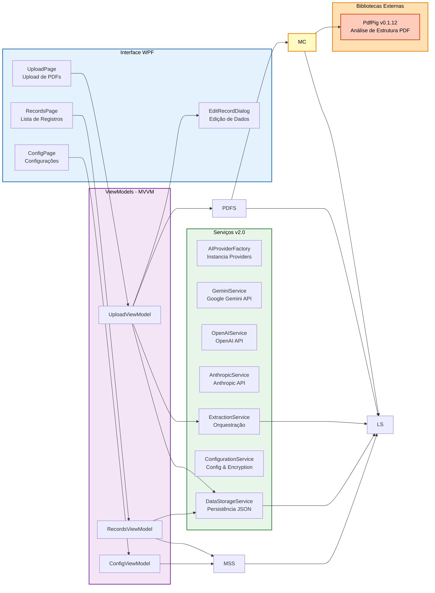

# Arquitetura do Sistema - EtnoPapers

> 📚 **Voltar ao README**: Veja [README.md](README.md) para informações gerais do projeto, instalação e como usar.

O EtnoPapers segue uma arquitetura em camadas que integra componentes locais e externos para processamento de documentos científicos.

### Visão Geral (C4 Model - Nível 1: Contexto do Sistema)

```mermaid
graph TB
    User[👤 Pesquisador<br/>Etnobotânico]

    subgraph Sistema["EtnoPapers v2.0"]
        App[EtnoPapers]
    end

    CloudAI[☁️ Provedores de IA<br/>Gemini | OpenAI | Anthropic]
    MongoDB[☁️ MongoDB<br/>Atlas ou Local]

    User -->|Upload PDFs<br/>Gerencia Registros| App
    App -->|Requisição JSON| CloudAI
    CloudAI -->|Metadados Extraídos| App
    App -->|Sincroniza Dados| MongoDB
    MongoDB -->|Confirma Upload| App

    style Sistema fill:#e1f5ff,stroke:#0066cc,stroke-width:3px,color:black
    style CloudAI fill:#fff4e6,stroke:#ff9800,stroke-width:2px,color:black
    style MongoDB fill:#e8f5e9,stroke:#4caf50,stroke-width:2px,color:black
    style User fill:#f3e5f5,stroke:#9c27b0,stroke-width:2px,color:black
```

**💡 Mudança v2.0**: Migração completa para provedores de IA em nuvem (Google Gemini, OpenAI, Anthropic Claude) com **50% de melhoria de desempenho** e sem necessidade de GPU local.

### Containers (C4 Model - Nível 2: Containers)

```mermaid
graph TB
    User[👤 Usuário]

    subgraph EtnoPapers["EtnoPapers Application v2.0"]
        UI[WPF Desktop UI<br/>C# .NET 8<br/>---<br/>Páginas: Upload, Registros,<br/>Configurações]

        Services[Camada de Serviços<br/>---<br/>AIProviderFactory<br/>GeminiService<br/>OpenAIService<br/>AnthropicService<br/>ExtractionService<br/>ConfigurationService]

        PdfPig[PdfPig Library<br/>v0.1.12<br/>---<br/>PDF Structure<br/>Analysis]

        LocalDB[(JSON Local<br/>---<br/>AppData/Local/<br/>EtnoPapers/<br/>config.json)]
    end

    CloudAI[Cloud AI Providers<br/>Gemini | OpenAI | Anthropic<br/>HTTPS REST]
    MongoDB[(MongoDB<br/>---<br/>Coleção:<br/>articles)]

    User -->|Interage| UI
    UI -->|Chama| Services
    Services -->|Usa| PdfPig
    Services -->|HTTPS Requisição| CloudAI
    Services -->|Lê/Escreve| LocalDB
    Services -->|Insert Documents| MongoDB

    style UI fill:#bbdefb,stroke:#1976d2,stroke-width:2px,color:black
    style Services fill:#c8e6c9,stroke:#388e3c,stroke-width:2px,color:black
    style PdfPig fill:#ffe0b2,stroke:#f57c00,stroke-width:2px,color:black
    style LocalDB fill:#fff9c4,stroke:#f57c00,stroke-width:2px,color:black
    style CloudAI fill:#ffccbc,stroke:#d84315,stroke-width:2px,color:black
    style MongoDB fill:#b2dfdb,stroke:#00796b,stroke-width:2px,color:black
```

### Componentes (C4 Model - Nível 3: Componentes Principais)



---

## Fluxo de Trabalho

O EtnoPapers processa documentos científicos através de um fluxo automatizado com validação humana.

```mermaid
flowchart TD
    Start([👤 Usuário inicia<br/>upload de PDF])

    Upload[📄 Upload do PDF<br/>Arquivo selecionado]
    ValidPDF{PDF válido?}

    CheckCloudAI{Cloud AI<br/>configurado?}
    ErrorCloudAI[❌ Erro: Configure<br/>provedor de IA]

    ConvertText[📝 Extração de Texto<br/>PdfPig: estrutura preservada]
    SendCloudAI[☁️ Envio para Provedor<br/>Gemini | OpenAI | Anthropic]

    ProcessAI[⚙️ Processamento IA<br/>Análise do conteúdo]

    ExtractMetadata[📋 Extração de metadados:<br/>- Título<br/>- Autores<br/>- Ano<br/>- Resumo<br/>- Espécies<br/>- Localização<br/>- Bioma]

    Validate{Dados<br/>completos?}

    ShowDialog[✏️ Janela de Edição<br/>EditRecordDialog]
    ReviewData[👁️ Usuário revisa<br/>e edita dados]

    UserAction{Ação do<br/>usuário?}

    SaveLocal[💾 Salvar no JSON local<br/>Documents/EtnoPapers/data.json]
    ShowSuccess[✅ Mensagem de sucesso<br/>Limpar tela]

    NavigateRecords[📚 Usuário navega<br/>para Registros]
    LoadRecords[🔄 Carregar registros<br/>do JSON]
    DisplayGrid[📊 Exibir em DataGrid<br/>Título, Ano, Autores, País, Bioma]

    SelectSync{Usuário seleciona<br/>registros para sync?}
    CheckMongo{MongoDB<br/>configurado?}
    SyncMongo[☁️ Sincronizar com MongoDB<br/>Upload de documentos]
    DeleteLocal[🗑️ Deletar registros locais<br/>após confirmação]

    End([✅ Processo concluído])
    Cancel([❌ Cancelado])

    Start --> Upload
    Upload --> ValidPDF
    ValidPDF -->|Não| ErrorCloudAI
    ValidPDF -->|Sim| CheckCloudAI
    CheckCloudAI -->|Não| ErrorCloudAI
    CheckCloudAI -->|Sim| ConvertText
    ConvertText --> SendCloudAI
    SendCloudAI --> ProcessAI
    ProcessAI --> ExtractMetadata
    ExtractMetadata --> Validate

    Validate -->|Completos ou<br/>Incompletos| ShowDialog
    ShowDialog --> ReviewData
    ReviewData --> UserAction

    UserAction -->|Salvar| SaveLocal
    UserAction -->|Cancelar| Cancel

    SaveLocal --> ShowSuccess
    ShowSuccess --> NavigateRecords
    NavigateRecords --> LoadRecords
    LoadRecords --> DisplayGrid

    DisplayGrid --> SelectSync
    SelectSync -->|Sim| CheckMongo
    SelectSync -->|Não| End

    CheckMongo -->|Configurado| SyncMongo
    CheckMongo -->|Não| End

    SyncMongo --> DeleteLocal
    DeleteLocal --> End

    ErrorCloudAI --> Cancel

    style Start fill:#c8e6c9,stroke:#388e3c,stroke-width:2px,color:black
    style End fill:#c8e6c9,stroke:#388e3c,stroke-width:2px,color:black
    style Cancel fill:#ffcdd2,stroke:#c62828,stroke-width:2px,color:black
    style ProcessAI fill:#fff9c4,stroke:#f57c00,stroke-width:2px,color:black
    style ShowDialog fill:#e1bee7,stroke:#7b1fa2,stroke-width:2px,color:black
    style SaveLocal fill:#bbdefb,stroke:#1976d2,stroke-width:2px,color:black
    style SyncMongo fill:#b2dfdb,stroke:#00796b,stroke-width:2px,color:black
```

---

## 🔧 Considerações Técnicas: Provedores de IA em Nuvem

### Integração com Provedores de IA em Nuvem

O EtnoPapers v2.0 utiliza provedores de IA em nuvem para extração de metadados com máxima qualidade e desempenho. A integração é feita via **HTTPS REST APIs** autenticadas com API keys.

**Fluxo Técnico (v2.0):**

```
PDF → PdfPig (extração texto) → AIProviderFactory → Provider Específico → Requisição JSON → Cloud API → JSON Response → Validação → ArticleRecord
```

**Vs. Fluxo Anterior (v1.x):**
```
PDF → MarkdownConverter → Markdown Estruturado → OLLAMAService (local) → API /api/generate → JSON Response → Validação → ArticleRecord
```

**💡 Benefício**: Provedores em nuvem oferecem **50% melhoria de desempenho** (5-8s vs 30-60s), melhor qualidade de extração, e zero necessidade de GPU local.

### Arquitetura de Provedores

Cada provedor implementa a interface `IAIProvider`:

1. **Google Gemini** - `GeminiService.cs`
   - Endpoint: `https://generativelanguage.googleapis.com/v1beta/models/gemini-1.5-flash:generateContent`
   - Autenticação: Query parameter `?key={apiKey}`
   - Modelo: gemini-1.5-flash (rápido, gratuito)
   - Tempo médio: 3-5 segundos por PDF

2. **OpenAI** - `OpenAIService.cs`
   - Endpoint: `https://api.openai.com/v1/chat/completions`
   - Autenticação: Bearer token no header
   - Modelo: gpt-4o-mini (balanceado)
   - Tempo médio: 5-8 segundos por PDF

3. **Anthropic** - `AnthropicService.cs`
   - Endpoint: `https://api.anthropic.com/v1/messages`
   - Autenticação: x-api-key header
   - Modelo: claude-3-5-sonnet (mais preciso)
   - Tempo médio: 5-8 segundos por PDF

### Recomendações por Caso de Uso

**Para iniciantes / uso ocasional:**
- **Google Gemini** ⭐ Recomendado
  - Gratuito (até 15 requisições/minuto)
  - Sem necessidade de cartão de crédito
  - Rápido e confiável
  - Ideal para testar o EtnoPapers

**Para uso profissional / alto volume:**
- **OpenAI GPT-4o-mini**
  - Custo: ~$0.15 por 1000 páginas
  - Qualidade excelente
  - API madura e estável
  - Integração robusta

**Para máxima qualidade científica:**
- **Anthropic Claude 3.5 Sonnet**
  - Custo: ~$0.25 por 1000 páginas
  - Melhor compreensão de contexto
  - Excelente para termos científicos
  - Nomenclatura botânica superior

### Configuração de Provedores

A configuração é centralizada em `ConfigurationService.cs`:

- **API Key**: Encriptada com Windows DPAPI
- **Armazenamento**: `AppData/Local/EtnoPapers/config.json` (gitignored)
- **Timeout**: 30 segundos (configurável)
- **Retry**: Exponential backoff automático (2s, 4s, 8s)
- **Error Handling**: Mensagens em português, retry automático para erros transitórios

### Segurança e Boas Práticas

- ✅ API keys **nunca** expostos em logs ou UI
- ✅ Criptografia com DPAPI (Windows)
- ✅ HTTPS-only para todas as requisições
- ✅ Timeout de 30 segundos previne travamentos
- ✅ Retry automático para erros transitórios (429, 5xx)
- ✅ Mensagens de erro amigáveis em português

### Melhorias Futuras

- Suporte a modelos vision para análise de imagens em PDFs
- Cache de respostas para PDFs similares
- Integração com novos modelos conforme lançados
- Load balancing entre provedores
- Fallback automático entre provedores em caso de erro

---

> 👉 Para detalhes de instalação e guia de uso, volte ao [README.md](README.md)
