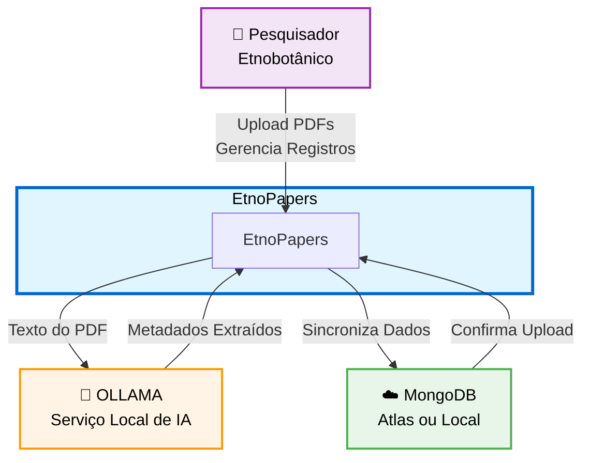
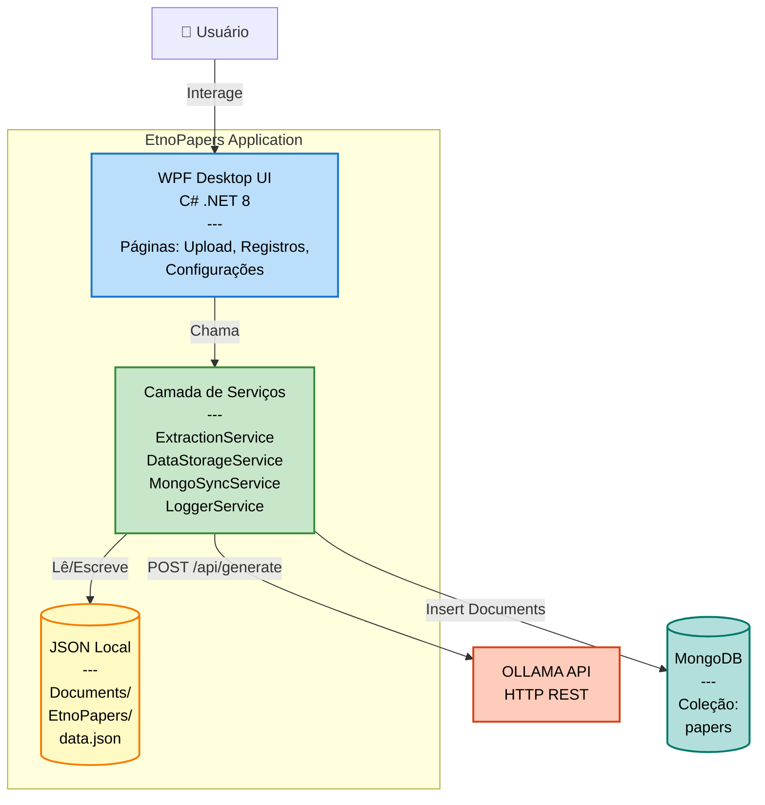
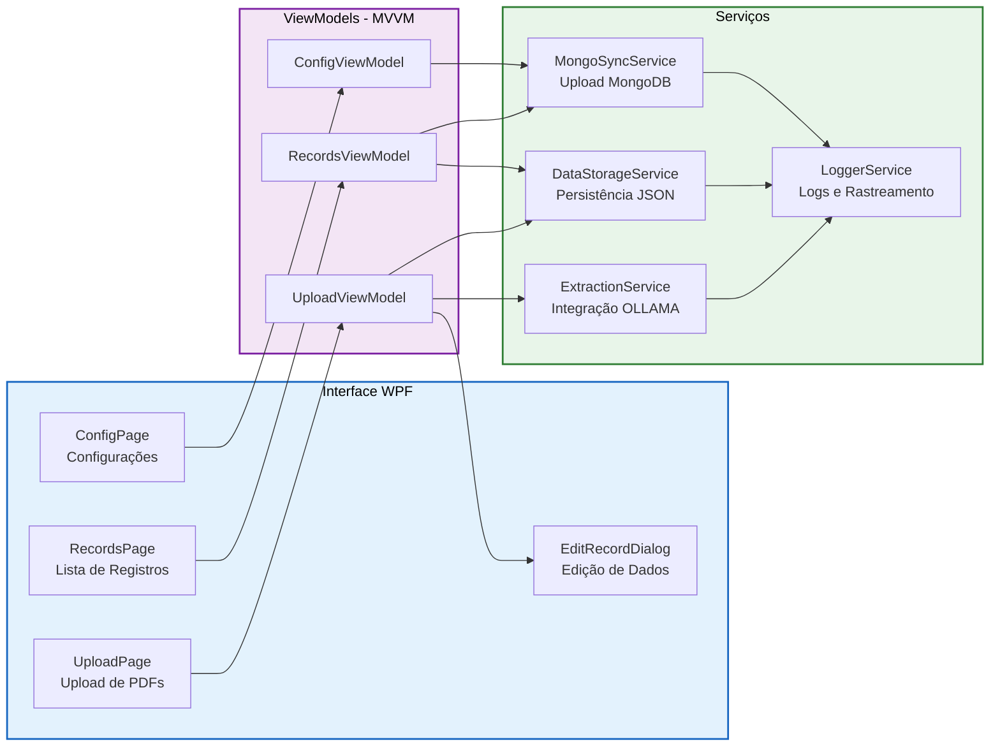

# Arquitetura do Sistema - EtnoPapers

> 📚 **Voltar ao README**: Veja [README.md](README.md) para informações gerais do projeto, instalação e como usar.

O EtnoPapers segue uma arquitetura em camadas que integra componentes locais e externos para processamento de documentos científicos.

### Visão Geral (C4 Model - Nível 1: Contexto do Sistema)



### Containers (C4 Model - Nível 2: Containers)



### Componentes (C4 Model - Nível 3: Componentes Principais)



---

## Fluxo de Trabalho

O EtnoPapers processa documentos científicos através de um fluxo automatizado com validação humana.

```mermaid
flowchart TD
    Start([👤 Usuário inicia<br/>upload de PDF])

    Upload[📄 Upload do PDF<br/>Arquivo selecionado]
    ValidPDF{PDF válido?}

    CheckOLLAMA{OLLAMA<br/>disponível?}
    ErrorOLLAMA[❌ Erro: OLLAMA<br/>não conectado]

    ExtractText[📖 Extração de texto<br/>do PDF]
    SendOLLAMA[🤖 Envio para OLLAMA<br/>com prompt configurado]

    ProcessAI[⚙️ Processamento IA<br/>Análise do conteúdo]

    ExtractMetadata[📋 Extração de metadados:<br/>- Título<br/>- Autores<br/>- Ano<br/>- Resumo<br/>- Espécies<br/>- Localização<br/>- Bioma]

    Validate{Dados<br/>completos?}

    ShowDialog[✏️ Janela de Edição<br/>EditRecordDialog]
    ReviewData[👁️ Usuário revisa<br/>e edita dados]

    UserAction{Ação do<br/>usuário?}

    SaveLocal[💾 Salvar no JSON local<br/>Documents/EtnoPapers/data.json]
    ShowSuccess[✅ Mensagem de sucesso<br/>Limpar tela]

    NavigateRecords[📚 Usuário navega<br/>para Registros]
    LoadRecords[🔄 Carregar registros<br/>do JSON]
    DisplayGrid[📊 Exibir em DataGrid<br/>Título, Ano, Autores, País, Bioma]

    SelectSync{Usuário seleciona<br/>registros para sync?}
    CheckMongo{MongoDB<br/>configurado?}
    SyncMongo[☁️ Sincronizar com MongoDB<br/>Upload de documentos]
    DeleteLocal[🗑️ Deletar registros locais<br/>após confirmação]

    End([✅ Processo concluído])
    Cancel([❌ Cancelado])

    Start --> Upload
    Upload --> ValidPDF
    ValidPDF -->|Não| ErrorOLLAMA
    ValidPDF -->|Sim| CheckOLLAMA
    CheckOLLAMA -->|Não| ErrorOLLAMA
    CheckOLLAMA -->|Sim| ExtractText
    ExtractText --> SendOLLAMA
    SendOLLAMA --> ProcessAI
    ProcessAI --> ExtractMetadata
    ExtractMetadata --> Validate

    Validate -->|Completos ou<br/>Incompletos| ShowDialog
    ShowDialog --> ReviewData
    ReviewData --> UserAction

    UserAction -->|Salvar| SaveLocal
    UserAction -->|Cancelar| Cancel

    SaveLocal --> ShowSuccess
    ShowSuccess --> NavigateRecords
    NavigateRecords --> LoadRecords
    LoadRecords --> DisplayGrid

    DisplayGrid --> SelectSync
    SelectSync -->|Sim| CheckMongo
    SelectSync -->|Não| End

    CheckMongo -->|Configurado| SyncMongo
    CheckMongo -->|Não| End

    SyncMongo --> DeleteLocal
    DeleteLocal --> End

    ErrorOLLAMA --> Cancel

    style Start fill:#c8e6c9,stroke:#388e3c,stroke-width:2px,color:black
    style End fill:#c8e6c9,stroke:#388e3c,stroke-width:2px,color:black
    style Cancel fill:#ffcdd2,stroke:#c62828,stroke-width:2px,color:black
    style ProcessAI fill:#fff9c4,stroke:#f57c00,stroke-width:2px,color:black
    style ShowDialog fill:#e1bee7,stroke:#7b1fa2,stroke-width:2px,color:black
    style SaveLocal fill:#bbdefb,stroke:#1976d2,stroke-width:2px,color:black
    style SyncMongo fill:#b2dfdb,stroke:#00796b,stroke-width:2px,color:black
```



---

## 🔧 Considerações Técnicas: OLLAMA e Modelos de IA

### Integração com OLLAMA

O EtnoPapers utiliza OLLAMA como serviço de IA local para extração de metadados. A integração é feita via **API REST HTTP** na porta padrão `11434`.

**Fluxo Técnico:**

```
PDF → Texto Extraído → OLLAMAService → Prompt Estruturado → API /api/generate → JSON Response → Validação → ArticleRecord
```

### Modelo Recomendado: Qwen 2.5 7B

**Para máxima compatibilidade e desempenho, use: `ollama pull qwen2.5:7b`**

**Por que Qwen 2.5 7B é a melhor escolha para EtnoPapers:**

1. **Suporte Robusto a Português**
   - Treinamento específico em português brasileiro
   - Compreensão de termos científicos e etnobotânicos
   - Melhor handling de nomes vernaculares/científicos

2. **Excelência em Extração Estruturada (JSON)**
   - Modelo especializado em retornar JSON válido
   - Menos erros de sintaxe nas respostas
   - Melhor parsing das estruturas de dados esperadas

3. **Desempenho Otimizado**
   - Tempo médio: 15-30 segundos por PDF
   - Timeout configurado para 10 minutos (adequado)
   - Uso de RAM: 8-10 GB (compatível com máquinas comuns)

4. **Qualidade de Extração**
   - Taxa mais alta de campos extraídos corretamente
   - Menos alucinações e dados fictícios
   - Melhor compreensão de contexto etnobotânico

### Alternativas e Fallbacks

Se Qwen 2.5 não for adequado para sua máquina:

- **Qwen 2.5 14B** (16+ GB RAM): Versão maior, mais precisa
- **Mistral 7B**: Rápido, suporte razoável a português
- **Neural Chat 7B**: Compacto, menos preciso para JSON
- **Llama 2 7B**: Legacy, requer mais validação manual

### Configuração no OLLAMAService

O serviço é configurado em `src/EtnoPapers.Core/Services/OLLAMAService.cs`:

- **URL padrão**: `http://localhost:11434`
- **Timeout base**: 5 minutos, com retry até 10 minutos
- **Retry logic**: 2 tentativas com timeout crescente
- **Auto-detection**: Sistema detecta melhor modelo disponível

### Melhorias Futuras

- Suporte a modelos vision para análise de imagens em PDFs
- Cache de embeddings para PDFs similares
- Integração com modelos mais novos (Qwen 3.0, etc)
- Quantização para rodar em máquinas com menos RAM

---

> 👉 Para detalhes de instalação e guia de uso, volte ao [README.md](README.md)
