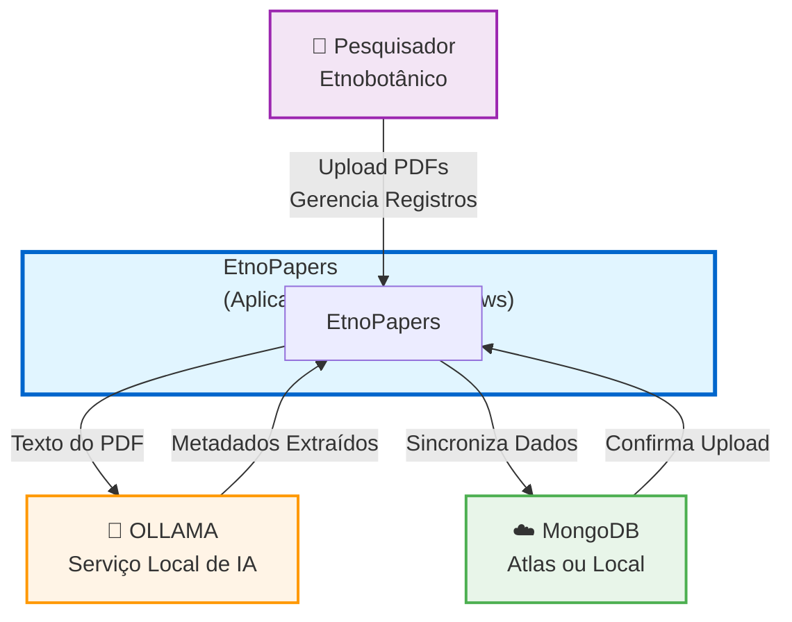
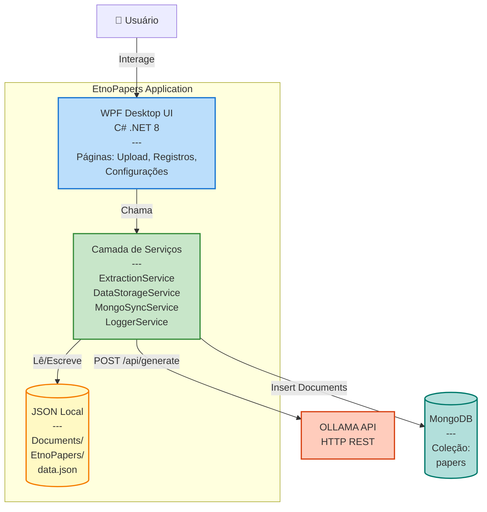
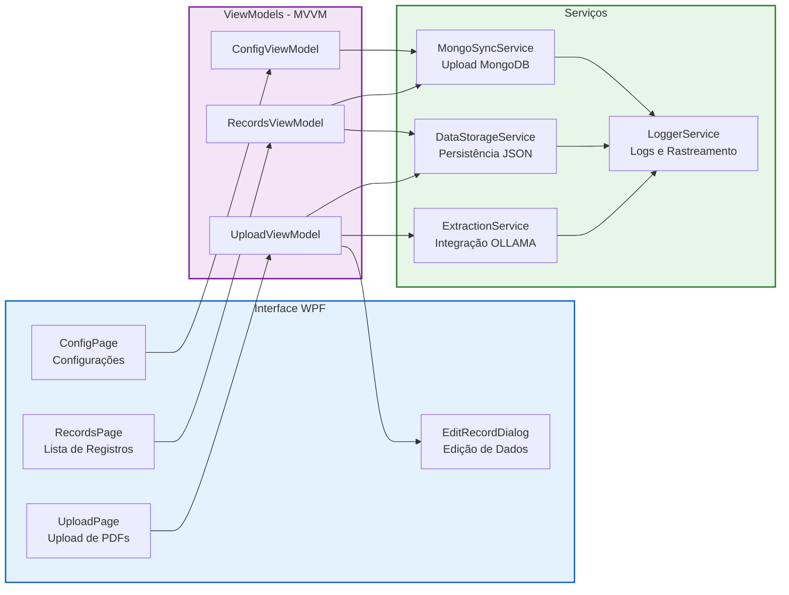

# EtnoPapers

**Aplicação Desktop para Extração Automatizada de Metadados Etnobotânicos**

---

## Sobre o EtnoPapers

O EtnoPapers é uma aplicação desktop nativa para Windows desenvolvida para pesquisadores em etnobotânica que precisam catalogar e organizar dados sobre o uso tradicional de plantas por comunidades indígenas e tradicionais.

Com o EtnoPapers, você pode:

- ✨ **Extrair automaticamente** metadados de artigos científicos em PDF usando inteligência artificial
- 📝 **Gerenciar** suas referências com interface completa de edição (criar, visualizar, editar, deletar)
- ☁️ **Sincronizar** seus dados com MongoDB (Atlas ou servidor local) para backup e segurança
- 🔧 **Personalizar** a extração com prompts configuráveis para o modelo de IA
- 🌿 **Catalogar** espécies de plantas, comunidades estudadas, localizações geográficas e metodologias

---

## Arquitetura do Sistema

O EtnoPapers segue uma arquitetura em camadas que integra componentes locais e externos para processamento de documentos científicos.

### Visão Geral (C4 Model - Nível 1: Contexto do Sistema)

### Containers (C4 Model - Nível 2: Containers)

### Componentes (C4 Model - Nível 3: Componentes Principais)

---

## Fluxo de Trabalho

O EtnoPapers processa documentos científicos através de um fluxo automatizado com validação humana.

```mermaid
flowchart TD
    Start([👤 Usuário inicia<br/>upload de PDF])

    Upload[📄 Upload do PDF<br/>Arquivo selecionado]
    ValidPDF{PDF válido?}

    CheckOLLAMA{OLLAMA<br/>disponível?}
    ErrorOLLAMA[❌ Erro: OLLAMA<br/>não conectado]

    ExtractText[📖 Extração de texto<br/>do PDF]
    SendOLLAMA[🤖 Envio para OLLAMA<br/>com prompt configurado]

    ProcessAI[⚙️ Processamento IA<br/>Análise do conteúdo]

    ExtractMetadata[📋 Extração de metadados:<br/>- Título<br/>- Autores<br/>- Ano<br/>- Resumo<br/>- Espécies<br/>- Localização<br/>- Bioma]

    Validate{Dados<br/>completos?}

    ShowDialog[✏️ Janela de Edição<br/>EditRecordDialog]
    ReviewData[👁️ Usuário revisa<br/>e edita dados]

    UserAction{Ação do<br/>usuário?}

    SaveLocal[💾 Salvar no JSON local<br/>Documents/EtnoPapers/data.json]
    ShowSuccess[✅ Mensagem de sucesso<br/>Limpar tela]

    NavigateRecords[📚 Usuário navega<br/>para Registros]
    LoadRecords[🔄 Carregar registros<br/>do JSON]
    DisplayGrid[📊 Exibir em DataGrid<br/>Título, Ano, Autores, País, Bioma]

    SelectSync{Usuário seleciona<br/>registros para sync?}
    CheckMongo{MongoDB<br/>configurado?}
    SyncMongo[☁️ Sincronizar com MongoDB<br/>Upload de documentos]
    DeleteLocal[🗑️ Deletar registros locais<br/>após confirmação]

    End([✅ Processo concluído])
    Cancel([❌ Cancelado])

    Start --> Upload
    Upload --> ValidPDF
    ValidPDF -->|Não| ErrorOLLAMA
    ValidPDF -->|Sim| CheckOLLAMA
    CheckOLLAMA -->|Não| ErrorOLLAMA
    CheckOLLAMA -->|Sim| ExtractText
    ExtractText --> SendOLLAMA
    SendOLLAMA --> ProcessAI
    ProcessAI --> ExtractMetadata
    ExtractMetadata --> Validate

    Validate -->|Completos ou<br/>Incompletos| ShowDialog
    ShowDialog --> ReviewData
    ReviewData --> UserAction

    UserAction -->|Salvar| SaveLocal
    UserAction -->|Cancelar| Cancel

    SaveLocal --> ShowSuccess
    ShowSuccess --> NavigateRecords
    NavigateRecords --> LoadRecords
    LoadRecords --> DisplayGrid

    DisplayGrid --> SelectSync
    SelectSync -->|Sim| CheckMongo
    SelectSync -->|Não| End

    CheckMongo -->|Configurado| SyncMongo
    CheckMongo -->|Não| End

    SyncMongo --> DeleteLocal
    DeleteLocal --> End

    ErrorOLLAMA --> Cancel

    style Start fill:#c8e6c9,stroke:#388e3c,stroke-width:2px
    style End fill:#c8e6c9,stroke:#388e3c,stroke-width:2px
    style Cancel fill:#ffcdd2,stroke:#c62828,stroke-width:2px
    style ProcessAI fill:#fff9c4,stroke:#f57c00,stroke-width:2px
    style ShowDialog fill:#e1bee7,stroke:#7b1fa2,stroke-width:2px
    style SaveLocal fill:#bbdefb,stroke:#1976d2,stroke-width:2px
    style SyncMongo fill:#b2dfdb,stroke:#00796b,stroke-width:2px
```

---

## Funcionalidades Principais

### 🤖 Extração Inteligente com IA

Carregue seus artigos em PDF e deixe a inteligência artificial extrair automaticamente:

- **Metadados obrigatórios**: título (normalizado), autores (formato APA), ano de publicação, resumo (em português brasileiro)
- **Dados etnobotânicos**: espécies de plantas (nomes vernaculares e científicos), tipos de uso, comunidades estudadas
- **Dados geográficos**: país, estado, município, localização específica, bioma
- **Informações do estudo**: fonte de publicação, metodologia aplicada

### 📚 Gestão Completa de Referências

Interface intuitiva para gerenciar todas as suas referências processadas:

- Visualize todas as fichas extraídas em formato de tabela organizada
- Edite qualquer campo dos registros, incluindo adição de novos atributos personalizados
- Crie novos registros manualmente quando necessário
- Delete referências que não são mais necessárias
- Marque fichas para envio ao banco de dados remoto

### ☁️ Sincronização com MongoDB

Mantenha seus dados seguros e acessíveis:

- Conecte-se ao MongoDB Atlas (nuvem) ou servidor local
- Selecione quais fichas deseja enviar para o banco de dados
- Upload automático com confirmação de sucesso
- Registros enviados com sucesso são removidos do armazenamento local
- Avisos automáticos para lembrar você de fazer backup regular

### ⚙️ Configuração Flexível

- Configure o prompt de IA para personalizar a extração de dados
- Informe a URI de conexão com seu MongoDB
- Configurações persistem entre sessões
- Indicadores de status de conexão para IA e banco de dados

---

## Requisitos do Sistema

### Requisitos Obrigatórios

- **Sistema Operacional**: Windows 10 ou superior
- **OLLAMA**: Serviço de IA local (deve ser instalado separadamente)
  - O OLLAMA é fundamental para o funcionamento do programa
  - Upload de PDFs só é habilitado com OLLAMA conectado
- **Conexão com Internet**: Necessária para sincronização com MongoDB Atlas

### Recomendações

- **GPU (Placa de vídeo dedicada)**: Melhora significativamente o desempenho da extração de dados pela IA
- **MongoDB**: Conta no MongoDB Atlas (gratuita) ou servidor MongoDB local para backup de dados

---

## Instalação

1. **Instale o OLLAMA** (pré-requisito obrigatório)
   - Visite o site oficial do OLLAMA (https://ollama.ai) e siga as instruções de instalação
   - Certifique-se de que o serviço está rodando antes de usar o EtnoPapers
   - Baixe um modelo compatível (ex: `ollama pull llama2`)

2. **Baixe o EtnoPapers**
   - Acesse a seção de Releases no GitHub
   - Baixe a versão mais recente do executável

3. **Execute o EtnoPapers**
   - O aplicativo é distribuído como executável único (single-file)
   - Não requer instalação - basta executar o arquivo `.exe`
   - Todas as dependências estão incluídas no executável

4. **Configure o MongoDB** (opcional, mas recomendado)
   - Crie uma conta gratuita no MongoDB Atlas ou instale um servidor local
   - Obtenha a URI de conexão do seu banco de dados
   - Configure a URI nas configurações do EtnoPapers

---

## Como Usar

### Primeira Configuração

1. Abra o EtnoPapers
2. Vá para a área de **Configurações**
3. Verifique o status de conexão com o OLLAMA (deve estar verde/conectado)
4. Configure o prompt de IA (opcional - um prompt padrão é fornecido)
5. Informe a URI de conexão com o MongoDB (se disponível)
6. Teste a conexão com o MongoDB

### Processar um Artigo

1. Na tela principal, clique em **Upload de PDF** ou arraste um arquivo para a área designada
2. Aguarde o processamento - o sistema mostrará uma janela de progresso
3. Após a extração, a janela de edição abrirá automaticamente
4. Revise os dados extraídos pela IA
5. Edite qualquer campo conforme necessário
6. Adicione informações complementares ou atributos personalizados
7. Clique em **Salvar** para armazenar o registro localmente

### Gerenciar Referências

1. Acesse a aba **Registros**
2. Visualize todas as fichas processadas em formato de tabela
3. A lista é atualizada automaticamente sempre que você visita a página
4. Veja as principais informações: Título, Ano, Autores, País e Bioma
5. Selecione registros para editar ou sincronizar com MongoDB

### Sincronizar com MongoDB

1. Na aba **Registros**, selecione os registros que deseja enviar para o banco de dados
2. Clique em **Sincronizar com MongoDB**
3. Aguarde a confirmação de upload
4. Registros enviados com sucesso serão removidos do armazenamento local

> ⚠️ **Importante**: Faça upload regular dos seus dados para o MongoDB para garantir backup e bom desempenho do sistema. O armazenamento local tem limite de registros.

---

## Dados Extraídos

### Campos Obrigatórios

Sempre extraídos de cada artigo:

- **Título** (normalizado)
- **Autores** (formato APA)
- **Ano** de publicação
- **Resumo** (sempre em português brasileiro)

### Campos Opcionais

Extraídos quando disponíveis no documento:

- Fonte de publicação
- **Espécies de plantas** (nome vernacular, nome científico, tipo de uso)
- **Comunidades estudadas** (nome, localização)
- **Dados geográficos** (país, estado, município, local específico)
- **Bioma**
- **Metodologia** do estudo

### Estrutura de Dados

A estrutura completa dos dados extraídos está documentada em `docs/estrutura.json`.

---

## Tecnologias Utilizadas

- **Framework**: .NET 8.0
- **Interface**: WPF (Windows Presentation Foundation)
- **Arquitetura**: MVVM (Model-View-ViewModel)
- **IA Local**: OLLAMA (API REST)
- **Armazenamento Local**: JSON
- **Banco de Dados**: MongoDB (Atlas ou local)
- **Linguagem**: C#

---

## Notas Importantes

- 📄 **PDFs não são armazenados**: Todos os arquivos PDF enviados são descartados após o processamento por questões de armazenamento e privacidade
- 💾 **Backup regular**: Sempre sincronize seus dados com o MongoDB para evitar perda de informações
- 🎯 **Limite de armazenamento local**: Há um número máximo de registros no arquivo local. O sistema avisará quando se aproximar do limite
- 🔌 **OLLAMA obrigatório**: Sem o OLLAMA instalado e rodando, não é possível processar PDFs
- 🚀 **Use GPU**: Uma placa de vídeo dedicada melhora muito o desempenho da IA
- ✏️ **Edição sempre disponível**: Após a extração, a janela de edição sempre abre para você revisar os dados, independente de estarem completos ou não

---

## Suporte

Para questões, problemas ou sugestões sobre o EtnoPapers, use o [Issues](https://github.com/edalcin/etnopapers/issues).

---

**Versão**: 1.0.0
**Licença**: [A definir]
**Última atualização**: Dezembro 2024
